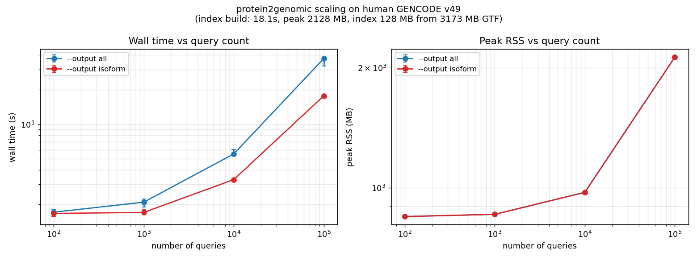

# Prot2Exon

Map protein domain coordinates to genomic / transcript structure using a GTF annotation.

For each input query (a `protein_id` **or** a `transcript_id`, and, optionally, an aa range), the tool answers two related but distinct questions:

1. **Mapping** — *which exact genomic bases code this domain?*
2. **Structure / visualization** — *how is the whole transcript organized in 5′UTR / CDS / 3′UTR / intron, and where does the domain fall on it?*

The two questions correspond to different output modes (`coding`, `introns`, `span`, `isoform`, `bed12`, `all`). Each mode emits every feature of its type (e.g. every CDS or every intron of the transcript) together with a column that says which ones overlap the domain. The companion BED / BED12 is the subset that actually overlaps with the domain.

A separate `plot` subcommand renders `isoform_structure.tsv` to PDF/PNG/SVG (matplotlib) or to an interactive HTML page (plotly).

> **Don't have a BED of aa ranges yet?** [scripts/](scripts/) converts InterProScan TSV, UniProt feature tables (`.dat` or REST JSON), and HMMER Pfam `--domtblout` into the BED-like format this tool eats — including the UniProt-accession → ENSP step.

A row that has only a `protein_id` (no aa range) is processed as *whole-transcript structure with no domain* — overlap columns are `NA` and the BED subsets are empty for that row. This makes it easy to plot a protein's transcript architecture even before any domain annotation exists.

---

## Table of contents

1. [Build](#build)
2. [Quickstart](#quickstart)
3. [Input format](#input-format)
4. [Output modes](#output-modes)
5. [Coordinate conventions](#coordinate-conventions)
6. [File-by-file schemas](#file-by-file-schemas)
   - [domain_mapping_summary.tsv](#domain_mapping_summarytsv)
   - [Feature TSVs (coding / introns / isoform)](#feature-tsvs-domain_cds_segmentstsv--domain_intronstsv--isoform_structuretsv)
   - [Companion BEDs](#companion-beds)
   - [domain_blocks.bed12](#domain_blocksbed12)
   - [MANE Select / Ensembl Canonical](#mane-select--ensembl-canonical)
   - [CDS-length mismatch (Sec, readthrough, incomplete CDS)](#cds-length-mismatch-sec-readthrough-incomplete-cds)
   - [Codons split across exons (1+2 vs 2+1)](#codons-split-across-exons-12-vs-21)
   - [unmapped_domains.tsv](#unmapped_domainstsv)
   - [run_metadata.json](#run_metadatajson)
7. [Worked example](#worked-example)
8. [Python API](#python-api)
9. [Plotting](#plotting)
10. [Benchmarks](#benchmarks)
11. [GTF compatibility & index](#gtf-compatibility--index)
12. [CLI reference](#cli-reference)

---

## Build

Requirements: C++17, CMake ≥ 3.16, OpenMP (optional, parallelizes per-query processing).

```bash
mkdir build && cd build
cmake -DCMAKE_BUILD_TYPE=Release ..
make -j$(nproc)
```

The binary is produced at `build/prot2exon`.

## Quickstart

```bash
# 1. Build a binary index from a GTF (one-time per annotation)
./prot2exon --gtf gencode.v49.primary_assembly.annotation.gtf \
                  --build-index --index human.idx

# 2. Map a BED of domain queries using that index
./prot2exon --index human.idx \
                  --bed domains.bed \
                  --out-dir results \
                  --output all
```

`--out-dir` is created if missing.

## Input format

Whitespace-separated, BED-like. Lines beginning with `#` are ignored.

```
# rows with a domain (ENSP or ENST, with or without version)
ENSP00000269305      10    50    AD1    TF1
ENST00000269305.9    10    50    AD1_ENST    TF1   # same answer as the line above
ENSP00000306245       5   100    RD1    TF2

# row without a domain (whole-transcript structure)
ENSP00000418960
```

| Column | Required | Meaning |
|---|---|---|
| 1 | yes | `id` — `ENSP*` (protein) or `ENST*` (transcript). Versioned or unversioned; the suffix is stripped on both sides. |
| 2 | no  | `aa_start` — 1-based inclusive. Omit (or set to 0) for no-domain mode. |
| 3 | no  | `aa_end` — 1-based inclusive. Omit (or set to 0) for no-domain mode. |
| 4 | no  | `domain_id` (used as `input_id` for tracking) |
| 5+ | no | ignored |

If column 4 is missing and a domain is present, `input_id` falls back to `id:aa_start-aa_end`. In no-domain mode it falls back to `id`. Every row remains identifiable in the outputs.

**ENST vs ENSP.** An ENST query is resolved to the same intervals as the matching ENSP, so the two give identical mapping output. A *non-coding* ENST (no CDS records in the GTF) is reported in `unmapped_domains.tsv` with `reason = no_CDS_for_protein` and `protein_id = NA`. The summary's `input_id_type` column records which form was supplied (`ENSP` / `ENST`).

## Output modes

Pass `--output KIND` together with `--out-dir DIR`. All modes additionally write `domain_mapping_summary.tsv` (one row per input query, ok or not) and `unmapped_domains.tsv` (only if at least one row failed).

| `--output` | Question it answers | TSV(s) written | BED(s) written |
|---|---|---|---|
| `coding`  | Where are the CDS exons of this transcript, and which overlap the domain? | `domain_cds_segments.tsv` (all CDS rows + overlap) | `domain_cds_segments.bed` (subset: `coding_overlap` rows) |
| `introns` | Where are the introns of this transcript, and which lie within the domain span? | `domain_introns.tsv` (all intron rows + overlap) | `domain_introns.bed` (subset: `inside_domain_genomic_span` rows) |
| `span`    | What is the single genomic envelope of the domain, introns included? | — | `domain_span_with_introns.bed` (one row per domain) |
| `isoform` | How is the whole transcript organized (UTR/CDS/intron), and where does the domain fall on it? | `isoform_structure.tsv` (all structural rows) | — |
| `bed12`   | One IGV-ready BED12 row per domain, blocks = CDS slices coding the domain. | — | `domain_blocks.bed12` |
| `all` (default) | Everything above. | all four TSVs | all four BEDs + `run_metadata.json` |

### Notes on `coding` and `introns`

These modes emit **all** features of that type in the transcript. The TSV is the full table, and the BED is the subset that overlaps with the domain — so you can drop the BED directly into bedtools/IGV without filtering, while the TSV lets you reason about non-overlapping features too.

In no-domain mode, the overlap columns are `NA` and the companion BEDs are empty for those rows (there is no domain to subset to).

### Notes on `isoform`

This is the plot-ready table. One row per structural feature. CDS exons that the domain partially covers are **split** so that the domain-overlapping portion and the non-overlapping portion are separate rows. **The split rows keep the original CDS number** — only `feature_part` distinguishes them. See [CDS splitting](#cds-splitting--feature_id-and-feature_part) below.

## Coordinate conventions

| Output | System |
|---|---|
| `*.bed` | 0-based half-open (BED standard). `start = 0-based inclusive`, `end = 0-based exclusive`. |
| `*.tsv` | 1-based inclusive for genomic, CDS-nt, and aa coordinates. Same as GTF. |

`NA` means *not applicable to this row* (e.g. CDS-nt fields on a UTR row, or overlap fields in no-domain mode).

> **Why does the BED differ by 1 from the TSV?** Same interval, different convention. A CDS at GTF positions `7676219..7676272` (1-based inclusive, length 54) is BED `7676218..7676272` (0-based half-open, length still 54). `end - start` matches the length in both systems; only `start` shifts.

---

## File-by-file schemas

### `domain_mapping_summary.tsv`

One row per input query, written for every `--output` mode.

| Column | Type | Meaning |
|---|---|---|
| `input_id` | string | User-supplied identifier |
| `protein_id` | string | Normalized (version suffix stripped) |
| `transcript_id` | string | Transcript that this protein belongs to |
| `gene_id` | string | Ensembl gene id |
| `gene_name` | string | HGNC-style gene symbol |
| `domain_id` | string | BED column 4 (if any) |
| `chrom`, `strand` | | Chromosome and strand of the transcript |
| `aa_start`, `aa_end` | int / NA | Input domain bounds; `NA` in no-domain mode |
| `domain_length_aa` | int / NA | `aa_end − aa_start + 1` |
| `domain_length_nt` | int / NA | `domain_length_aa × 3` |
| `protein_length_aa` | int | Total CDS length / 3 for this protein |
| `domain_genomic_start` / `_end` | int / NA | Genomic envelope of the domain |
| `n_coding_segments` | int / NA | Number of CDS exon slices the domain spans |
| `fully_mapped` | bool | `true` if the entire aa range fits inside the CDS |
| `no_domain_mode` | bool | `true` if the BED row had no aa range |
| `input_id_type` | `ENSP` / `ENST` / `NA` | Which kind of id the user supplied |
| `is_mane_select` | `true` / `false` / `NA` | MANE Select transcript? `NA` if the GTF lacks tag attributes. |
| `is_ensembl_canonical` | `true` / `false` / `NA` | Ensembl_canonical transcript? `NA` if the GTF lacks tag attributes. |
| `cds_length_mismatch` | bool | `true` if `sum(CDS_nt) % 3 != 0` (Sec, readthrough, incomplete) |
| `cds_nt_remainder` | int (0, 1, 2) | `sum(CDS_nt) % 3` |
| `status` | string | `ok` / `ok_cds_mismatch` / `partial` / `partial_cds_mismatch` / `structure_only` / unmapped reason |

### Feature TSVs (`domain_cds_segments.tsv`, `domain_introns.tsv`, `isoform_structure.tsv`)

All three share the same column layout, differing only in which feature types they include:

| File | Rows |
|---|---|
| `domain_cds_segments.tsv` | every CDS row |
| `domain_introns.tsv`      | every intron row |
| `isoform_structure.tsv`   | every 5′UTR / CDS / 3′UTR / intron row |

You can therefore `cat` or `join` them on `input_id`/`feature_id` interchangeably.

#### Identity columns

| Column | Meaning |
|---|---|
| `input_id` | User-supplied identifier; trace each row back to its BED row |
| `gene_id` | Ensembl gene id |
| `gene_name` | Gene symbol |
| `transcript_id` | Transcript id |
| `protein_id` | Normalized protein id |
| `domain_id` | Domain id from BED column 4 |

#### Location columns

| Column | Meaning |
|---|---|
| `chrom` | Chromosome |
| `strand` | `+` or `−` |
| `feature_genomic_start` | 1-based inclusive |
| `feature_genomic_end` | 1-based inclusive |
| `feature_length_nt` | `end − start + 1` |

#### Feature-type columns

| Column | Meaning |
|---|---|
| `feature_type` | One of `five_prime_UTR`, `CDS`, `three_prime_UTR`, `intron` |
| `feature_id` | **Stable across splits**. Numbered in translation order: `CDS_1` is the most 5′ CDS of the protein, then `CDS_2`, etc. UTRs and introns are numbered separately (`five_prime_UTR_1`, `intron_1`, …) |
| `feature_part` | 1..K when a CDS row was split by partial domain overlap; pieces of the same original CDS share the same `feature_id` and differ by `feature_part`. Always `1` for UTR / intron rows |
| `exon_number` | Source GTF `exon_number` for UTR / CDS rows; `NA` for introns |

#### CDS splitting — `feature_id` and `feature_part`

A single GTF CDS exon can be split into multiple isoform-structure rows when the domain only covers part of it. The pieces always share the same `feature_id` — only `feature_part` differs. Example: domain ends in the middle of `CDS_2` (translation order), so `CDS_2` produces two rows:

| feature_id | feature_part | start | end | overlaps_domain |
|---|---|---|---|---|
| CDS_2 | 1 | 75278995 | 75279120 | coding_overlap |
| CDS_2 | 2 | 75279121 | 75279123 | no |

To re-aggregate the full original CDS, group by `(input_id, feature_id)`. To plot the overlap shape, fill by `plot_group` and ignore `feature_part`.

#### Ordering columns

| Column | Meaning |
|---|---|
| `feature_order_genomic` | 1..N along the chromosome (low → high coord). Always equals row position |
| `feature_order_transcript` | 1..N in translation direction. Equals `feature_order_genomic` on `+` strand; reversed on `−` strand |

For `−` strand genes, plot using `feature_genomic_start/end` on the X axis (genomic coords), but use `feature_order_transcript` to interpret biological order (5′ → 3′ of the protein).

#### CDS-coordinate columns (NA on UTR / intron rows)

| Column | Meaning |
|---|---|
| `cds_nt_start` | CDS-relative nt offset (1-based) of this slice's first base |
| `cds_nt_end` | CDS-relative nt offset of the last base |
| `aa_start_encoded` | First aa that this slice encodes (1-based) |
| `aa_end_encoded` | Last aa that this slice encodes |

The mapping is `aa = ⌈cds_nt / 3⌉`. A 1-nt CDS slice that contains only the third base of an aa still reports that aa in `aa_start_encoded` / `aa_end_encoded`.

#### Domain-overlap columns

`overlaps_domain` is **not a yes/no flag** — it discriminates *coding* overlap from *intronic* overlap inside the domain envelope:

| Value | Meaning |
|---|---|
| `no` | The row is outside the domain entirely. UTR rows always carry `no` |
| `coding_overlap` | CDS row whose genomic interval overlaps a domain-coding range |
| `inside_domain_genomic_span` | Intron located between two `coding_overlap` CDS rows |
| `NA` | No-domain query (no domain to compare against) |

The companion columns are filled only for `coding_overlap` rows:

| Column | Meaning |
|---|---|
| `domain_overlap_genomic_start` / `_end` | Sub-interval of this row that codes the domain (1-based inclusive) |
| `domain_overlap_cds_nt_start` / `_end` | Same overlap projected to CDS-nt (1-based) |
| `domain_overlap_aa_start` / `_end` | Same overlap projected to aa |
| `domain_overlap_fraction_of_feature` | overlap_length / `feature_length_nt` |
| `domain_overlap_fraction_of_domain` | overlap_length / `domain_length_nt`. Sums to `1.0` across all `coding_overlap` rows of the same domain |

#### Plotting column

`plot_group` is a single string suitable for direct color mapping:

With a domain:

| Value | Maps to |
|---|---|
| `five_prime_UTR` / `three_prime_UTR` | UTR exon segment |
| `CDS_no_domain` | CDS outside the domain |
| `CDS_domain` | CDS that encodes the domain |
| `intron` | Intron outside the domain genomic span |
| `intron_domain_span` | Intron between two `CDS_domain` rows |

In no-domain mode, `plot_group` is just the feature type: `five_prime_UTR`, `CDS`, `three_prime_UTR`, `intron`.

In `ggplot`/`ggtranscript`-style code:

```r
ggplot(rows, aes(xmin = feature_genomic_start, xmax = feature_genomic_end,
                 y = transcript_id, fill = plot_group)) +
  geom_rect()
```

### Companion BEDs

All three companion BEDs are 6-column standard BED (`chrom`, `start_0based`, `end`, `name`, `score=0`, `strand`).

| File | Rows |
|---|---|
| `domain_cds_segments.bed` | CDS rows with `overlaps_domain == coding_overlap` |
| `domain_introns.bed` | intron rows with `overlaps_domain == inside_domain_genomic_span` |
| `domain_span_with_introns.bed` | one row per domain (genomic envelope, introns included) |

`name` is `protein_id[_domain_id]_<aa_start>-<aa_end>`. No-domain queries contribute zero rows to any companion BED.

### `domain_blocks.bed12`

One BED12 row per domain. The whole feature is drawn thick in IGV; blocks are the CDS slices that code the domain. Empty in no-domain mode.

| BED12 field | Meaning here |
|---|---|
| `chrom` | chromosome |
| `chromStart` (0-based) | first base of the domain genomic envelope |
| `chromEnd` | last base + 1 of the envelope (so `end − start` = envelope length, introns included) |
| `name` | `protein_id[_domain_id]_<aa_start>-<aa_end>` |
| `score` | `0` |
| `strand` | transcript strand |
| `thickStart` / `thickEnd` | equal to `chromStart` / `chromEnd` — IGV draws the whole feature thick |
| `itemRgb` | `255,0,0` (red) |
| `blockCount` | number of CDS slices that code the domain (`coding_overlap` rows) |
| `blockSizes` | comma-separated, in genomic order |
| `blockStarts` | comma-separated offsets from `chromStart`, in genomic order |

Drop this directly onto a track in IGV / UCSC and you see the domain's exonic blocks with the in-domain introns rendered as the BED12 gaps.

### MANE Select / Ensembl Canonical

GENCODE GTFs (since v34) carry `tag "MANE_Select"` and `tag "Ensembl_canonical"` on every feature of the relevant transcripts. The tool parses these and surfaces them in two new columns on `domain_mapping_summary.tsv` and on every feature TSV:

| Column | Values |
|---|---|
| `is_mane_select` | `true` / `false` / `NA` |
| `is_ensembl_canonical` | `true` / `false` / `NA` |

`NA` is reserved for the case where the GTF carries **no** `tag` attribute anywhere — typical of base Ensembl GTFs. We treat absence-of-information differently from "tag attributes exist but this transcript doesn't carry MANE_Select" (which is `false`). Filter to MANE Select queries with:

```
awk -F'\t' 'NR==1 || $20=="true"' domain_mapping_summary.tsv   # column 20 = is_mane_select
```

### CDS-length mismatch (Sec, readthrough, incomplete CDS)

The tool maps every query, but flags the rare cases where the CDS isn't a multiple of 3.

| Column | Meaning |
|---|---|
| `cds_length_mismatch` | `true` if `sum(CDS_nt) % 3 != 0` |
| `cds_nt_remainder` | `0`, `1`, or `2` (the remainder) |
| `status` | gains a `_cds_mismatch` suffix (`ok_cds_mismatch`, `partial_cds_mismatch`) |

This catches:
- **Selenoproteins (GPX4, SELENO*)** — internal `TGA` re-coded as Sec, plus an SECIS-driven C-terminal extension that makes the annotated CDS longer than `protein_length × 3`.
- **Stop-codon readthrough** — annotated CDS extends past a `TGA` / `TAG` that is bypassed by the ribosome.
- **Incomplete 5′ or 3′** GENCODE transcripts with `cds_start_NF` / `cds_end_NF`.

The aa↔nt math still uses floor division (`aa = ⌈cds_nt / 3⌉`), so a domain at the very C-terminus of an incomplete CDS may be clipped by 1–2 aa; the `cds_length_mismatch` flag is your hint to check.

### Codons split across exons (1+2 vs 2+1)

A codon that straddles an exon boundary is mapped correctly in both phases — the underlying math is purely cumulative-nt-based, not exon-by-codon. Two synthetic test cases included in [tests/](tests/) exercise this:

```
#                            aa 1  aa 2  aa 3
# 1+2 split: CDS_1 = 1 nt of codon 2, CDS_2 = remaining 2 nt
CDS_1   pos 100..103   (4 nt → aa 1 + first base of aa 2)
intron  pos 104..199
CDS_2   pos 200..204   (5 nt → last 2 bases of aa 2 + aa 3)
domain aa 2..2 ⇒ CDS_1 row with aa overlap 2..2 (overlap_fraction_of_domain ≈ 1/3)
                ⇒ CDS_2 row with aa overlap 2..2 (overlap_fraction_of_domain ≈ 2/3)
                ⇒ intron in between marked inside_domain_genomic_span
```

The 2+1 case is symmetric (`CDS_1 = 5 nt`, `CDS_2 = 4 nt`). In both phases, summing `domain_overlap_fraction_of_domain` over `coding_overlap` rows equals `1.0`.

### `unmapped_domains.tsv`

Written only when at least one row failed.

| Column | Meaning |
|---|---|
| `input_id`, `protein_id`, `aa_start`, `aa_end`, `domain_id` | identity (`protein_id = NA` for non-coding ENST queries) |
| `reason` | one of: `protein_not_in_index`, `no_CDS_for_protein`, `domain_beyond_protein_length`, `no_overlap` |

### `run_metadata.json`

Written only with `--output all`. Records:

- `tool`, `version`, `timestamp_utc`
- `output_kind` — the value of `--output`
- `annotation_source` — path to GTF or index used
- `index_format_version`
- `coordinate_conventions` — restated explicitly
- `query_counts` — `{ total, mapped, unmapped, no_domain_mode }`
- `cli` — full argv of the invocation

---

## Worked example

Input BED:
```
ENSP00000306245    5    100    RD1    TF2
```

`ENSP00000306245` is a `+` strand transcript with this layout:
```
[CDS slice 1]   intron 1   [CDS slice 2]   intron 2   [CDS slice 3]   ...
75278983..94    75279124..  75279877..035   ...
```

Domain `RD1` (aa 5..100) spans the end of slice 1 and most of slice 2. The relevant rows of `isoform_structure.tsv` look like (selected columns shown):

| feature_type | feature_id | feature_part | feature_genomic_start | feature_genomic_end | aa_start_encoded | aa_end_encoded | overlaps_domain | plot_group |
|---|---|---|---|---|---|---|---|---|
| CDS | CDS_1 | 1 | 75278983 | 75278994 | 1 | 4 | no | CDS_no_domain |
| CDS | CDS_2 | 1 | 75278995 | 75279123 | 5 | 47 | coding_overlap | CDS_domain |
| intron | intron_1 | 1 | 75279124 | 75279876 | NA | NA | inside_domain_genomic_span | intron_domain_span |
| CDS | CDS_3 | 1 | 75279877 | 75280035 | 48 | 100 | coding_overlap | CDS_domain |
| CDS | CDS_4 | 1 | 75280036 | 75280128 | 101 | 131 | no | CDS_no_domain |
| intron | intron_2 | 1 | 75280129 | 75280559 | NA | NA | no | intron |
| ... | ... | ... | ... | ... | ... | ... | ... | ... |
| three_prime_UTR | three_prime_UTR_1 | 1 | 75281422 | 75282230 | NA | NA | no | three_prime_UTR |

To plot, fill by `plot_group`. To highlight the domain, the rows you want are `plot_group ∈ {CDS_domain, intron_domain_span}`. To get just the genomic bases that code the domain, take `domain_cds_segments.bed` (it already contains only the `coding_overlap` rows).

If the same input file had `ENSP00000306245` on its own line (no aa columns), an additional set of rows for the whole transcript would be emitted, all with `overlaps_domain = NA`, `plot_group = CDS / intron / five_prime_UTR / three_prime_UTR`.

---

## Benchmarks

Measured on a single core against the pre-built human GENCODE v49 index (3.17 GB GTF → 128 MB binary index). Reproduce with `python3 benchmarks/run_benchmark.py && python3 benchmarks/plot_benchmark.py`.



### Index build (one-time per annotation)

| Metric | Value |
|---|---|
| GTF size (uncompressed) | 3,173 MB |
| Lines parsed | ~5.8 M |
| Wall time | **18.1 s** |
| Peak RSS | 2.1 GB |
| Output index size | 128 MB |
| Compression ratio | ~25× |

The index includes per-protein exon and CDS intervals plus `gene_id`, `gene_name`, `exon_number`. You build it once and reuse it forever (or until GENCODE updates).

### Query performance (single-threaded, median of 3 reps)

| Queries | `--output all` (wall / peak RSS) | `--output isoform` (wall / peak RSS) |
|---|---|---|
| 100 | 1.7 s / 847 MB | 1.6 s / 847 MB |
| 1,000 | 2.1 s / 858 MB | 1.7 s / 859 MB |
| 10,000 | 5.5 s / 974 MB | 3.3 s / 974 MB |
| 100,000 | 37 s / 2,126 MB | 17.6 s / 2,125 MB |

Effective throughput at 100k queries: ~2,800 q/s in `--output all` mode, ~5,700 q/s in `--output isoform` mode. The `all` mode is slower because it writes four TSV files and three BED files vs. one TSV in `isoform`.

The constant ~1.5 s floor at small N is index loading. Once the index is in memory, per-query cost is roughly linear and dominated by output formatting. Memory grows because output strings accumulate before being written; running with `--threads N` shifts time but not peak RSS appreciably.

### Reproducing the benchmark

```bash
# In the conda env that has matplotlib + numpy
python3 benchmarks/run_benchmark.py \
  --sizes 100 1000 10000 100000 \
  --modes all isoform \
  --reps 3 --threads 1

python3 benchmarks/plot_benchmark.py
# results.tsv, index_build.json, scaling.png in benchmarks/
```

You can add `--sizes 1000000` for a million-query stress test (allow ~5–10 min). Use `--threads N` to test parallelism.

---

## GTF compatibility & index

Both major GTF flavours work without configuration:

- **GENCODE** — versioned IDs (`protein_id "ENSP00000306245.4"`)
- **Ensembl** — unversioned IDs (`protein_id "ENSP00000306245"`)

The tool normalizes IDs by stripping the `.<version>` suffix on both sides (GTF and BED), so a BED with versioned protein IDs works against an Ensembl-derived index, and vice versa.

The binary index format is versioned (`INDEX_FORMAT_VERSION = 3`); loading an older index returns an explicit error asking you to rebuild it. Version 3 adds the transcript→protein reverse map (so ENST queries resolve in the same lookup pass) and per-transcript MANE Select / Ensembl Canonical flags.

---

## Python API

`prot2exon` ships a Python wrapper that drives the C++ binary as a subprocess and reads the resulting TSVs back as pandas DataFrames. The C++ binary remains the source of truth for every mapping decision — Python only assembles BED rows, runs the binary, and parses the outputs.

```python
import prot2exon as p2e

# Reuse the same index across many calls
mapper = p2e.Mapper(index="human.idx")

# Single query
result = mapper.map("ENSP00000269305", aa_start=10, aa_end=50, domain_id="AD1")
result.summary      # pd.DataFrame, one row per query
result.isoform      # plot-ready table
result.cds_segments # only the CDS rows
result.introns
result.bed12        # IGV-ready BED12
result.unmapped     # only the failures

# ENST works too (resolves to the same intervals as the matching ENSP)
mapper.map("ENST00000269305", aa_start=10, aa_end=50, domain_id="AD1")

# Batch (a single binary invocation, much cheaper than many .map() calls)
queries = [
    {"protein_id": "ENSP00000269305", "aa_start": 10, "aa_end": 50, "domain_id": "AD1"},
    {"protein_id": "ENST00000303562", "aa_start": 5,  "aa_end": 100, "domain_id": "RD1"},
    {"protein_id": "ENSP00000418960"},  # no aa range -> structure_only
]
batch = mapper.map_batch(queries)
batch.n_total, batch.n_mapped, batch.n_unmapped

# Slice a batch result to a single query
just_rd1 = batch.by_input_id("RD1")

# Plot directly from a result, or from a DataFrame, or from a path
p2e.plot(result, out="AD1.pdf")
p2e.plot(batch.isoform, input_id="RD1", out="RD1.pdf")
p2e.plot("results/isoform_structure.tsv", input_id="AD1", out="AD1.pdf")

# Plot every query (multipage PDF if `.pdf`)
p2e.plot_all(batch, out="all_queries.pdf")

# One-shot — no Mapper instance needed
result = p2e.map_query("ENSP00000269305", 10, 50, "AD1", index="human.idx")

# Persist outputs on disk instead of using a tempdir
result = mapper.map("ENSP00000269305", 10, 50, "AD1",
                    keep_outputs="my_results")
# Same files the CLI would write:
#   my_results/{domain_mapping_summary.tsv, isoform_structure.tsv, ...}

# Read an existing output directory back into a MappingResult
result = p2e.read_results_dir("my_results")
```

### Binary discovery

`Mapper(index=...)` finds the C++ binary by checking, in order:

1. The `binary=` constructor argument.
2. `$PROT2EXON_BIN`.
3. `<repo>/build/prot2exon` (development).
4. `<repo>/bin/prot2exon` (the shell wrapper).
5. `prot2exon-core` on PATH, then `prot2exon` on PATH.

For installed users, ship the compiled binary on PATH or set `PROT2EXON_BIN`.

### Install

```bash
# From the repo (development mode)
pip install -e python/

# Or from a wheel built via `python -m build python/`
```

Dependencies: `pandas>=1.4`, `matplotlib>=3.5`. Optional `plotly>=5.0` for the interactive HTML output (`p2e.plot(..., html=...)`).

## Plotting

`prot2exon plot` renders `isoform_structure.tsv` to a publication-ready figure. Run after mapping:

```bash
# One domain to PDF
prot2exon plot \
    --isoform results/isoform_structure.tsv \
    --input-id RD1 --out RD1.pdf

# Every input_id in the TSV to a multipage PDF
prot2exon plot \
    --isoform results/isoform_structure.tsv \
    --all --out queries.pdf

# Interactive HTML (requires plotly: pip install plotly)
prot2exon plot \
    --isoform results/isoform_structure.tsv \
    --input-id RD1 --html RD1.html
```

Options:

| Flag | Default | Effect |
|---|---|---|
| `--input-id ID` / `--all` | — | Pick one query, or render every `input_id`. |
| `--out FILE` | — | PDF / PNG / SVG (matplotlib). Multipage PDF when combined with `--all`. |
| `--html FILE` | — | Interactive plotly HTML. |
| `--no-highlight` | off | Don't color CDS_domain segments red. |
| `--no-introns` | off | Hide intron lines (keeps the X axis genomic; introns become gaps). |
| `--no-utr` | off | Hide UTR boxes. |
| `--spliced` | off | Concatenate non-intron features in translation order ("spliced transcript" view). |
| `--width`, `--height` | 12, 2.2 | Figure size in inches. |
| `--title STR` | derived | Override the figure title. |

The plot reads the TSV directly — it doesn't re-derive coordinates from the genome — so any feature you can express by editing `isoform_structure.tsv` (e.g. filtering to a specific transcript, joining with annotation, etc.) is plottable.

## CLI reference

```
USAGE
  prot2exon --gtf FILE --build-index --index FILE
  prot2exon (--gtf FILE | --index FILE) --bed FILE --out-dir DIR [--output KIND]
  prot2exon plot --isoform FILE (--input-id ID | --all) [--out F] [--html F]

OPTIONS
  --bed FILE       Query file (TSV/BED-like). Rows can be:
                     id  aa_start  aa_end  [domain_id]
                   or, for whole-transcript structure with no domain:
                     id
                   `id` can be an ENSP (protein) or ENST (transcript).
  --out-dir DIR    Output directory (created if missing).
  --gtf FILE       GTF annotation, parsed on the fly.
  --index FILE     Pre-built binary index (faster, recommended).
  --output KIND    {coding, introns, span, isoform, bed12, all}. Default: all.
  --build-index    Build a binary index from --gtf into --index.
  --threads NUM    Process queries in parallel via OpenMP. Default: 1.
  --verbose        Log progress to stderr.
  --version        Print version and exit.
  --help           Full help including all output schemas.
```

Run `prot2exon --help` for the full schema reference at the terminal.

## License

MIT.
